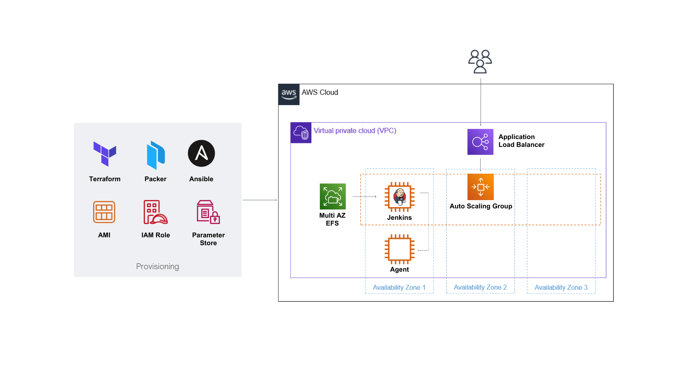

<h1 align="center">
  <br/>
  Setup Jenkins với AWS Autoscaling Group, Load Balancer và EFS
</h1>
<p align="center">Triển khai Jenkins với AWS Autoscaling group cùng Application Load Balancer và multi-AZ EFS.</p>

<p align="center"><a href="https://www.terraform.io/" target="_blank"></a>&nbsp;<a href="https://www.jenkins.io/" target="_blank"></a>&nbsp;<a href="https://www.ansible.com/" target="_blank"></a>&nbsp;<a href="https://www.docker.com/" target="_blank"></a>&nbsp;<a href="https://aws.amazon.com/" target="_blank"></a></p>

<p align="center">
    <b>LANGUAGE</b>
</p>
<p align="center">
    <a href="README.md"></a>
    <a href="https://devopscube.com/jenkins-autoscaling-setup/"></a>
</p>

## 💝 Nguồn tham khảo

GitHub: https://github.com/techiescamp/devops-projects <br>
Blog: https://devopscube.com/jenkins-autoscaling-setup/

## ⚡️ Tổng quan

Chúng ta sẽ tập trung vào một số concept như:
- [Immutable Infrastructure](https://devopscube.com/immutable-infrastructure/): Mô hình cơ sở hạ tầng không thay đổi sau khi được triển khai. Các thành phần sẽ được thay thế (replace) thay vì thay đổi (change).
- [Infrastructure as Code](https://devopscube.com/infrastructure-as-code-configuration-management/) (Provisioning & Configuration Management): Thiết lập, quản lý cơ sở hạ tầng hệ thống thông qua các file script.
- External Config/Secret management: Quản lý thông tin bí mật.

#### Các tool DevOps được sử dụng
- Packer: dùng để build [AMIs](https://devopscube.com/packer-tutorial-for-beginners/) cho Jenkins Controller và Agent.
- Ansible: đóng vai trò làm [provisioner cho Packer](https://developer.hashicorp.com/packer/plugins/provisioners/ansible/ansible) để cấu hình Jenkins controller và agent trong quá trình build AMI.
- Terraform: dùng để tạo các AWS resource.
- Python Boto3: AWS SDK để lấy SSH public key từ AWS Parameter Store.

#### Các dịch vụ AWS sẽ sử dụng
- IAM: tạo IAM Role/Instance Profile cho Agent truy cập vào AWS Parameter Store để lấy SSH public key.
- EFS: lưu dữ liệu của Jenkins Controller.
- AWS Parameter Store: lưu private và public keys để sử dụng thiết lập SSH giữa Jenkins Controller và Agent.
- Autoscaling Group: triển khai High Availability Jenkins Controller
- Application Load Balancer: cung cấp DNS endpoint cho Jenkins Controller instance trong Autoscaling group.

## 📖 Cấu trúc dự án

```
jenkins-setup-aws/
├── ansible/
│   ├── roles/
│   │   ├── jenkins-agent/ tasks/
│   │   │   ├── java.yaml
│   │   │   ├── main.yaml
│   │   │   ├── ssh.yaml (../../../scripts/get-ssh-pub.py)
│   │   │   ├── tools.yaml
│   │   ├── jenkins-controller/
│   │       ├── task/
│   │       │   ├── base.yaml
│   │       │   ├── efs.yaml
│   │       │   ├── jenkins.yaml (../templates/override.conf.j2)
│   │       │   ├── main.yaml
│   │       ├── templates/
│   │           ├── override.conf.j2
│   ├── scripts/
│   │   ├── get-ssh-pub.py
│   ├── jenkins-agent.yaml
│   ├── jenkins-controller.yaml
├── terraform/
│   ├── agent/
│   │   ├── main.tf (../modules/ec2/)
│   ├── efs/
│   │   ├── main.tf (../modules/efs/)
│   ├── iam/
│   │   ├── main.tf (../modules/iam/)
│   ├── lb-asg/
│   │   ├── main.tf (../modules/lb-asg/)
│   ├── modules/
│   │   ├── ec2/
│   │   │   ├── main.tf
│   │   │   ├── variable.tf
│   │   ├── efs/
│   │   │   ├── main.tf
│   │   │   ├── variable.tf
│   │   ├── iam/
│   │   │   ├── main.tf
│   │   │   ├── variable.tf
│   │   ├── lb-asg/
│   │   │   ├── main.tf
│   │   │   ├── variable.tf
├── jenkins-agent.pkr.hcl (ansible/jenkins-agent.yaml)
├── jenkins-controller.pkr.hcl (ansible/jenkins-controller.yaml)
```

- `jenkins-controller.pkr.hcl` và `jenkins-agent.pkr.hcl` là những Packer configuration file, khi dùng Packer chạy sẽ đồng thời run Ansible playbook trong thư mục `ansible/`
- Thư mục `ansible/` gồm các role mà playbook sẽ sử dụng.
- Mỗi resource cần tạo sẽ có các file terraform riêng biệt để chạy trong thư mục tương ứng, chi tiết các resource nằm trong các file ở thư mục `module/`.

## ⚙️ Trước khi bắt đầu
Bạn cần cài đặt và thiết lập các tool này trên máy tính, laptop sử dụng cho việc triển khai dự án: 
- [Hashicorp Packer](https://developer.hashicorp.com/packer/downloads)
- [Terraform](https://developer.hashicorp.com/terraform/downloads?product_intent=terraform)
- [Ansible](https://docs.ansible.com/ansible/latest/installation_guide/intro_installation.html)
- [AWS CLI](https://docs.aws.amazon.com/cli/latest/userguide/getting-started-install.html), thiết lập AWS Credentials với quyền admin của tài khoản AWS và chọn region (Repo này mình chọn region Singapore: ap-southeast-1)

Chúng ta sẽ sử dụng VPC mặc định, 3 subnets mặc định tương ứng với 3 Availability Zone.

Tạo sẵ 1 keypairs trên tài khoản AWS của bạn ở region đã thiết lập để sử dụng khi cần dùng giao thức SSH. (Keypairs của mình sử dụng trong repo này tên là "jenkins-infr")

## ⚙️ Các bước sẽ thực hiện
- Tạo SSH public và private keys lưu vào AWS Parameter Store
- Tạo IAM Role để Agent có quyền lấy SSH public key từ AWS Parameter Store
- Tạo Agent AMI
- Dựng Agent
- Tạo EFS storage để mount vào Jenkins Controller
- Tạo Jenkins Controller AMI
- Dựng Jenkins Controller cùng Autoscaling Group và Load Balancer
- Thiết lập vai trò giữa Agent và Jenkins Controller

## Tạo SSH public và private keys lưu vào AWS Parameter Store
Trên máy tính của bạn, chạy lệnh sau để tạo một cặp private (id_rsa) và public key (id_rsa.pub)

```
ssh-keygen
```

Truy cập vào AWS Parameter Store, tạo 2 parameters loại "`Secure String`" với `Name` tương ứng là 2 đường dẫn sau:
```
/devops-tools/jenkins/id_rsa
/devops-tools/jenkins/id_rsa.pub
```

Mô phỏng cách tạo parameter:


## Tạo IAM Role để Agent có quyền lấy SSH public key từ AWS Parameter Store

Trong quá trình tạo AMI của Agent ở những bước sau với Packer, chúng ta sẽ cần IAM Role này để cấp quyền lấy public key (id_rsa.pub) đã lưu vào Parameter Store.

Vào thư mục `terraform/iam/`:
```
cd terraform/iam
```

Khởi tạo dự án terraform và chạy file cấu hình với các lệnh:
```
terraform init
terraform plan
terraform apply --auto-approve
```

Bước này sẽ tạo IAM role có tên `jenkins-role`, bạn có thể truy cập vào AWS console để kiểm tra IAM Role này cùng với policy đã tạo.

## Tạo AMI của Agent

Ở trong thư mục `ansible/roles/jenkins-agent/tasks`, chúng ta sẽ tạo các task cài đặt sẵ những tool như Terraform, Ansible, boto3, Java... 

Đặc biệt chú ý task trong file `ssh.yaml` sử dụng Python script trong thư mục `ansible/scripts/get-ssh-pub.py` để lấy public key đã tạo trên AWS Parameter Store và thêm vào SSH file `authorized_keys` trên Agent.

Khi build AMI, Packer sẽ tạo EC2 instance theo như chỉ định và dùng Ansible provisioner để thiết lập các cài đặt theo file playbook `jenkins-agent.yaml`. Quá trình build AMI như sau:


Tiến hành build AMI Agent bằng Packer với câu lệnh sau, truyền vào biến `public_key_path` sử dụng trong file ansible play book `Name` của parameter đã tạo cho public key trên AWS Parameter Store.
```
packer build -var "public_key_path=/devops-tools/jenkins/id_rsa.pub" jenkins-agent.pkr.hcl
```

Sau khi Packer thực thi thành công, bạn sẽ thấy `id` của AMI Agent được in ra ở output.

#### Giải thích cú pháp Packer HCL2 trong file *.pkr.hcl

[**Ansible Provisioner**](https://developer.hashicorp.com/packer/plugins/provisioners/ansible/ansible) 

`extra_arguments` ([]string) - chỉ định thêm các đối số truyền vào câu lệnh Ansible (truyền vào biến, option...)

[**ansible arguments**](https://docs.ansible.com/ansible/latest/cli/ansible.html)

`--scp-extra-args -0` - sử dụng OpenSSH "packet mode", hiệu quả hơn chế độ mặc định khi chuyển file qua các kết nối chậm, ít ổn định.
>ký hiệu single-quote `' '` được sử dụng để truyền `-0` vào dưới dạng một đối số. Nếu không có `' '`, `-0` sẽ bị coi như một option.
>```
>--scp-extra-args -0 
>--scp-extra-args '-0'
>```

`--ssh-extra-args -o IdentitiesOnly=yes -o HostKeyAlgorithms=+ssh-rsa -o PubkeyAcceptedAlgorithms=+ssh-rsa` - Ở phiên bản Openssh >= 8.8, thuật toán ssh-rsa đặc trưng mặc định bị tắt. Sử dụng các đối số trên cho `--ssh-extra-args` để xử lý vấn đề này ở phía Packer. Xem thêm về issue này [tại đây](https://github.com/hashicorp/packer-plugin-ansible/issues/140)

## Dựng Agent.
Để tạo Agent trên AWS, vào thư mục `terraform/agent`
```
cd terraform/agent
```

Mở file `main.tf`, thay các giá trị dưới đây:
- `subnet_ids`: thay bằng `id` của các defaults subnet ở region đã chọn.
- `key_name`: thay bằng `name` của AWS `keypairs` bạn đã tạo từ trước.
- `ami_id`: thay bằng `id` của Agent AMI vừa tạo ở bước trước.
> Nếu bạn muốn dự án có nhiều hơn 1 instance, có thể thay thế số lượng cho biến `instance_count`

```
module "ec2_instance" {
  source = "../modules/ec2"

  instance_name      = "jenkins-agent"
  ami_id             = "ami-06ac8ae58c3362210"
  instance_type      = "t2.small"
  key_name           = "jenkins-infra"
  subnet_ids         = ["subnet-07b9057320054ee22", "subnet-0174fcc4415e4ca39", "subnet-0f1c1a6c2e947b004"]
  instance_count     = 1
}
```

Chạy các lệnh sau để tiến hành tạo resource AWS bằng Terraform:
```
terraform init
terraform plan
terraform apply --auto-approve
```

## Tạo EFS storage để mount vào Jenkins Controller

Trong quá trình tạo AMI của Jenkins Controller ở những bước sau với Packer, chúng ta sẽ cần mount EFS này vào làm nơi lưu trữ dữ liệu Jenkins. Nhờ đó, khi Autoscaling group tạo Jenkins Controller instance mới, mọi dữ liệu cũng như thiết lập sẽ đều không bị mất đi hay thay đổi.

Vào thư mục `terraform/efs`:
```
cd terraform/efs
```

Mở file `main.tf` và thay thế thông tin `region`, `vpc_id` và `subnet_ids` thành Default VPC, Subnet ID ở region đã chọn trong tài khoản AWS của bạn.
```
provider "aws" {
  region = "ap-southeast-1"
}

module "efs_module" {
  source     = "../modules/efs"
  vpc_id     = "vpc-0c64f388611289f06"
  subnet_ids = ["subnet-07b9057320054ee22", "subnet-0174fcc4415e4ca39", "subnet-0f1c1a6c2e947b004"]
}
```

Khởi tạo dự án terraform và chạy file cấu hình với các lệnh:
```
terraform init
terraform plan
terraform apply --auto-approve
```

Bạn có thể kiểm tra lại resource EFS đã tạo trên AWS console


Chúng ta sẽ dùng `DNS name` của EFS đã tạo trong bước tạo AMI của Jenkins controller.

## Tạo AMI của Jenkins Controller

Tương tự cách tạo AMI của Agent, chúng ta chạy file `jenkins-controller.pkr.hcl` và truyền vào biến `efs_mount_point` giá trị DNS name của EFS đã tạo:
```
packer build -var "efs_mount_point=[Gía trị DNS name của EFS đã tạo]" jenkins-controller.pkr.hcl
```

Sau khi Packer thực thi thành công, bạn sẽ thấy `id` của Jenkins Controller AMI đã tạo và đăng ký trên AWS ở output.

## Dựng Jenkins Controller cùng Autoscaling Group và Load Balancer
Để triển khai Autoscaling group cùng load balancer, vào thư mục `terraform/lb-asg`:
```
cd terraform/lb-asg
```

Mở file `main.tf` và thay thế các giá trị của những biến sau:
- `subnets`: thay bằng `id` của các defaults subnet ở region đã chọn.
- `key_name`: thay bằng `name` của AWS `keypairs` bạn đã tạo từ trước.
- `ami_id`: thay bằng `id` của Jenkins Controller AMI vừa tạo ở bước trước.
- `vpc_id`: thay bằng `id` của default vpc ở region đã chọn.

Khởi tạo dự án terraform và chạy file cấu hình với các lệnh:
```
terraform init
terraform plan
terraform apply --auto-approve
```

Sau khi Terraform thực thi thành công, bạn có thể kiểm tra lại Autoscaling group và load balancer đã tạo trên AWS console.

Phía dưới phần Registered targets, bạn sẽ thấy 1 Jenkins Controller instance đã được tạo:


Mở load balancer `jenkins-alb` đã tạo, bạn sẽ lấy được DNS name của load balancer để truy cập vào Jenkins Controller


Ở lần đầu tiên truy cập Jenkins Controller, bạn sẽ thấy giao diện như sau:


Để unlock Jenkins, làm theo hướng dẫn SSH vào Jenkins Controller instance với AWS `keypairs` đã tạo và chạy câu lệnh:
```
sudo cat /data/jenkins/secrets/initialAdminPassword
```

Bạn có thể vào AWS console lấy địa chỉ IP public của Jenkins Controller instance hoặc thông qua AWS CLI bằng cách dùng câu lệnh sau:
```
aws ec2 describe-instances --filter "Name=tag:Name,Values=jenkins-controller" --query 'Reservations[].Instances[?State.Name==`running`].PublicIpAddress' --output text
```

Sau khi unlock Jenkins, làm theo hướng dẫn ở các bước kế tiếp và cài đặt những plugin gợi ý để bắt đầu sử dụng Jenkins.

## Thiết lập vai trò giữa Jenkins Controller và Agent
Đây là bước làm thủ công, chỉ cần thực hiện một lần khi tạo dự án.
Remote vào **Agent** instance, tạo user riêng cho jenkins

#### Tạo SSH credential truy cập vào Agent
Truy cập vào **Jenkins Controller**, ở giao diện Dashboard chọn `Manage Jenkins` > `Manage Credentials`


Chọn `Add Credentials` ở phần dropdown của global item:


Điền các thông tin cần thiết:
- Kind: SSH Username with private key
- id: jenkins-agent
- username: jenkins (do trong quá trình build AMI với packer, nếu bạn để ý trong file `jenkins-agent.pkr.hcl` và `ansible/roles/jenkins-agent/ssh.yaml` chúng ta đã tạo và sử dụng user **jenkins** để lưu public key vào file `authorized_keys` trên Agent)
- Private Key: truy cập vào AWS Parameter Store, copy giá trị của parameter tên `/devops-tools/jenkins/id_rsa` đã tạo ban đầu.


#### Thiết lập Agent cho Jenkins Controller 
Trên **Jenkins Controller**, ở giao diện Dashboard chọn `Manage Jenkins` > `Nodes and Clouds`

Chọn `New Node`, đặt tên cho Agent (mình sẽ đặt là Agent1) và chọn loại `Permanent Agent`
Điền các thông tin cần thiết:
- Remote root directory: /home/jenkins (thư mục trên **Agent**)
- label: **agent1** (lable này sẽ sử dụng để khai báo trong job, pipeline)
- usage: only build jobs with lable expression
- Launch method:
  - Host: địa chỉ public IP của Agent instance
  - Credential: chọn credential vừa tạo (id là jenkins-agent)
  - Host Key verfication Strategy: Non verifying verification strategy

Bấm `Save` để hoàn tất quá trình thiết lập.


Ở log của Node `Agent1`, dòng cuối sẽ thông báo **Agent successfully connected and online** nếu bạn thiết lập thành công.

#### Tạo job để kiểm tra
Trên **Jenkins Controller**, ở giao diện Dashboard chọn `New Item`
- Đặt tên `Name`: Test Job
- Chọn `Freestyle project` và bấm `OK`
- Chọn option `Restrict where this project can be run`
  - Ở phần Label Expression nhập `agent1` (tên đã đặt cho Agent vừa thiết lập)
- Chọn `Execute shell` ở phần **Build**
  - Thêm lệnh: `echo $NODE_NAME` ở phần `Command` của `Execute shell` để in ra log tên của agent thực thi job đó khi chạy.
- Bấm `Save` và chọn `Build Now`. Đợi vài giây và vào phần `Console Output`:

- Bạn sẽ thấy output tương tự như sau:
```
Started by user Admin User
Running as SYSTEM
Building remotely on agent1 in workspace /home/jenkins/workspace/First Job to Agent1
[First Job to Agent1] $ /bin/sh -xe /tmp/jenkins15623311211559049312.sh
+ echo $NODE_NAME
agent1
Finished: SUCCESS
```

## Dọn dẹp AWS resource
Để tránh phát sinh chi phí, hãy nhớ dọn dẹp các resource đã tạo cho dự án này khi không cần đến.

Vào lần lượt các thư mục trong `terraform/` và chạy lệnh:
```
terraform destroy
```

Truy cập AWS Console, chọn service EC2 và Deregister các AMI đã tạo, xóa các file trong phần Snapshots (nếu có). Tương tự tiếp tục xóa parameter đã tạo trong Parameter Store. 